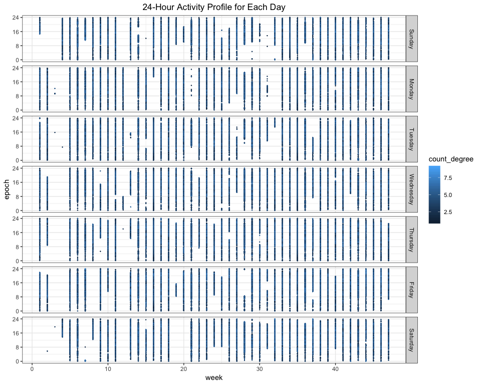

Midterm Project
================
Xinyi Lin
10/25/2018

This report is based on data collected from a accelerometerdevice which was worn by 63 year-old male with BMI 25, who was admitted to the Advanced Cardiac Care Center of Columbia University Medical Center and diagnosed with congestive heart failure (CHF) for several months. It aims to show the participant's pattern of physical activity over long periods of time.

Import and tidy data
====================

Import data
-----------

``` r
library(tidyverse)
```

    ## ── Attaching packages ──────────────────────────────────────────────────────────────────────── tidyverse 1.2.1 ──

    ## ✔ ggplot2 3.0.0     ✔ purrr   0.2.5
    ## ✔ tibble  1.4.2     ✔ dplyr   0.7.6
    ## ✔ tidyr   0.8.1     ✔ stringr 1.3.1
    ## ✔ readr   1.1.1     ✔ forcats 0.3.0

    ## ── Conflicts ─────────────────────────────────────────────────────────────────────────── tidyverse_conflicts() ──
    ## ✖ dplyr::filter() masks stats::filter()
    ## ✖ dplyr::lag()    masks stats::lag()

``` r
library(patchwork)

knitr::opts_chunk$set(
  fig.width = 10,
  fig.asp = 0.8,
  out.width = "100%"
)
theme_set(theme_bw())
```

``` r
mtp_data = read_csv(file = "./data/p8105_mtp_data.csv")
```

    ## Parsed with column specification:
    ## cols(
    ##   .default = col_double(),
    ##   week = col_integer(),
    ##   day = col_character()
    ## )

    ## See spec(...) for full column specifications.

Tidy data
---------

``` r
mtp_tidy_data =
  mtp_data %>% 
  janitor::clean_names() %>% 
  gather(key = "epoch", value = "counts", activity_1:activity_1440) %>% 
  mutate(counts = round(counts)) %>% 
  mutate(day = forcats::fct_relevel(day, c("Sunday", "Monday", "Tuesday", "Wednesday", "Thursday", "Friday", "Saturday"))) %>% 
  mutate(epoch = as.numeric(str_replace(epoch, "activity_", "")))

head(mtp_tidy_data)
```

    ## # A tibble: 6 x 4
    ##    week day      epoch counts
    ##   <int> <fct>    <dbl>  <dbl>
    ## 1     1 Friday       1      1
    ## 2     1 Monday       1      1
    ## 3     1 Saturday     1      1
    ## 4     1 Sunday       1      1
    ## 5     1 Thursday     1      1
    ## 6     1 Tuesday      1      1

In the tidied dataset, there are 473760 observations and 4 variables including `week`, `day`, `epoch` and `counts`.

Analyze data
============

Analyze the total activity variable
-----------------------------------

In this part, we analyze data by using total activity counts of a single day.

``` r
total_count_data =
  mtp_tidy_data %>% 
  group_by(week, day) %>% 
  summarise(total_count = sum(counts)) %>% 
  mutate(total_count = total_count*0.001)

head(total_count_data)
```

    ## # A tibble: 6 x 3
    ## # Groups:   week [1]
    ##    week day       total_count
    ##   <int> <fct>           <dbl>
    ## 1     1 Sunday           197.
    ## 2     1 Monday           433.
    ## 3     1 Tuesday          297.
    ## 4     1 Wednesday        369.
    ## 5     1 Thursday         366.
    ## 6     1 Friday           416.

``` r
total_count_data %>% 
  ggplot(aes(x = week, y = total_count)) +
  geom_point() +
  geom_smooth() +
  labs(title = "Change of Total Activity Counts over Time") +
  theme(plot.title = element_text(hjust = 0.5))
```

    ## `geom_smooth()` using method = 'loess' and formula 'y ~ x'


According to the picture, we can find that even though points which represent total activity in each day are discrete, when we apply them to local regression, we can get an almost non-decreasing line, which means this participant became more active over time and the hypothesis is true.

``` r
iso_time_plot = 
  total_count_data %>% 
  ggplot(aes(x = total_count, fill = day, color = day)) +
  geom_density() +
  facet_grid(day~.) +
  theme(legend.position = "none") +
  labs(title = "Distribution of Total Activity Counts of Day")

add_time_plot = 
  total_count_data %>% 
  ggplot(aes(x = week, y = total_count)) +
  geom_smooth(aes(color = day), se = FALSE) +
  labs(title = "Distribution of Total Activity Counts over time")

iso_time_plot + add_time_plot
```

    ## `geom_smooth()` using method = 'loess' and formula 'y ~ x'


Two plots above show how day of week affects activity in isolation and in addition to the effect of time. As we can find in the left plot, this participant's total counts are more concentrate around 300-400 from Monday to Thursday. This implies he has similar activity pattern in these days. According to the right plot, we can find that the total counts of Sunday, Friday and Saturday change a lot in different weeks, which matches the left plot.

Analyze 24-hour activity
------------------------

In this part, we used full dataset to analyze 24-hour activity.

``` r
mtp_tidy_data %>% 
  filter(counts != 1) %>% 
  mutate(count_degree = as.integer(log(counts))) %>% 
  ggplot(aes(x = week, y = epoch, color = count_degree)) +
  geom_point(size = .1) +
  facet_grid(day~.) +
  theme(legend.position = "right") +
  scale_y_continuous(
  breaks = c(0, 480, 960, 1440), 
  labels = c("0", "8", "16", "24")) +
  labs(title = "24-Hour Activity Profile for Each Day") +
  theme(plot.title = element_text(hjust = 0.5))
```



Through taking log of `counts`, we can get degree of activity counts. Assuming the participant doesn't move when `counts` equals one, we can know when the participant is active by filtering out "non-active observations" and draw a scatter plot. Points in each column show when the participant is active in that day of that week, and the color show the degree of activity counts.

``` r
mtp_tidy_data %>% 
  group_by(epoch, day) %>% 
  summarise(average_count = mean(counts)) %>% 
  ggplot(aes(x = epoch, y = average_count)) +
  geom_point(aes(color = day)) + 
  geom_smooth(se = FALSE) +
  facet_grid(~day) +
  theme(legend.position = "bottom") +
  scale_x_continuous(
  breaks = c(0, 480, 960, 1440), 
  labels = c("0", "8", "16", "24")) +
  labs(title = "24-Hour Activity Profile of Day") +
  theme(plot.title = element_text(hjust = 0.5))
```

    ## `geom_smooth()` using method = 'gam' and formula 'y ~ s(x, bs = "cs")'


According to the plot above, we can find that the participant was more active in Sunday and everyday through 8am to 4pm.

By comparing two plot in this part, we can find although day of week has little influence on whether the participant is active or not, it influences the activity degree.

Other exploratory analyses
--------------------------

### Time of wearing device

According to the plot of "24-Hour Activity Profile for Each Day", we can find in several day, there are almost no points. It implies the participant have no activity in that day, which makes no sense. So it might be caused by not wearing the accelerometerdevice. We can also find that this "lost-point situation" is less common over time, which implies the participant became accustomed to the device.

### Distribution of activity counts

``` r
mtp_tidy_data %>% 
  filter(counts != 1 & counts < 2000) %>% 
  ggplot(aes(x = counts)) +
  geom_density() +
  labs(title = "Distribution of Counts(1,2000)") +
  theme(plot.title = element_text(hjust = 0.5))
```

``` r
count_density_data =
  mtp_tidy_data %>% 
  filter(counts != 1 & counts < 2000) %>% 
  group_by(counts) %>% 
  summarise(n = n()) %>% 
  arrange(desc(n))

head(count_density_data)
```

    ## # A tibble: 6 x 2
    ##   counts     n
    ##    <dbl> <int>
    ## 1     11 13234
    ## 2     22  8948
    ## 3     32  7737
    ## 4     43  7124
    ## 5     53  6549
    ## 6     64  6067

If we draw a plot about the density of counts bigger than 1 and smaller than 2000 or count the number of these counts, we can find counts around 10 are more common, which might implies the voltage signals cauesed by daily life activity is around 10.
